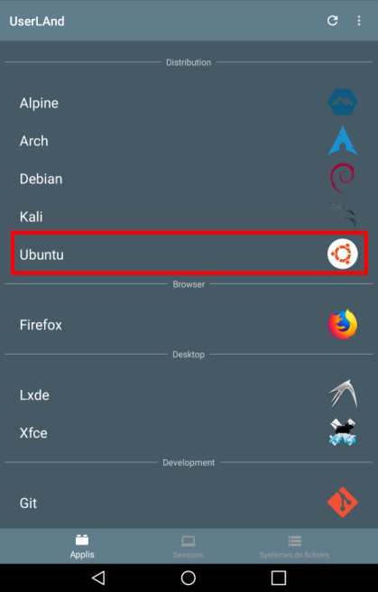
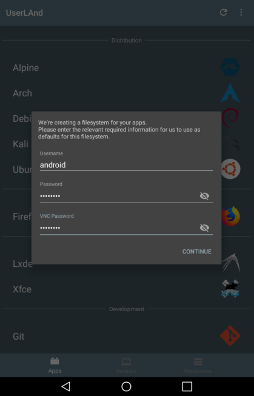
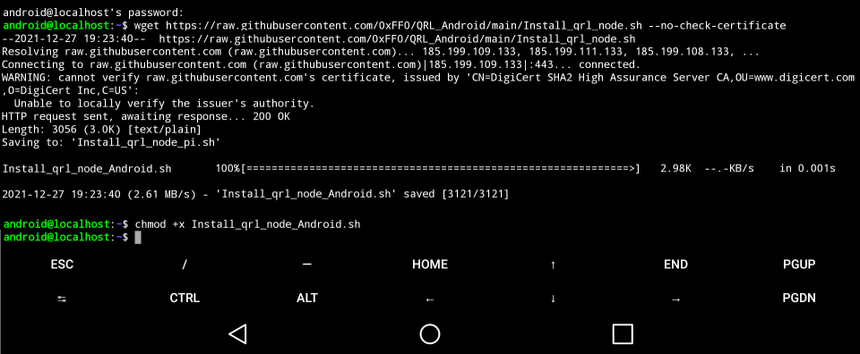
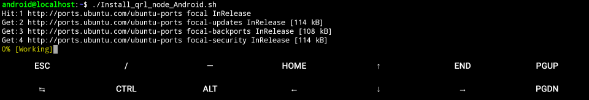
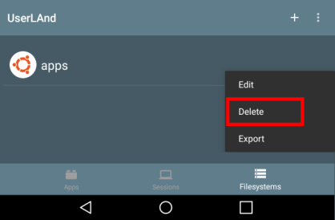

# Running a QRL node on Android

Running a [QRL](https://www.theqrl.org/) node strengthens the network, supports the decentralization and further verifies transactions on the network. 

This project is a PoC developped during the [QRL Winter Hackathon 2021](https://www.theqrl.org/blog/qrl-winter-hackathon-2021/).

## Android node setup

1) On Google play, [install UserLAnd](https://play.google.com/store/apps/details?id=tech.ula&hl=en). 
		
2) After installing the App, launch it and click on Ubuntu. You’ll be required to provide user login details that will be created for you during installation.

   <tr>
      <td></td>
      <td></td>
   </tr>  

3) Go in the "Sessions" tab and launch an Ubuntu session. 

4) Download the installation script and make the script executable.

	    $ wget https://raw.githubusercontent.com/0xFF0/QRL_Android/main/Install_qrl_node_Android.sh --no-check-certificate
	    $ chmod +x Install_qrl_node_Android.sh

  

5) Run the script (it can takes multiple hours to setup everything).

	    $ ./Install_qrl_node_Android.sh

  

6) When you’re done, you can start the QRL node. 

	    $ start_qrl

## Uninstall

If you want to uninstall Ubuntu and/or start from scratch, you can delete the filesystem used by the Ubuntu App.

Warning: all data will be erased. To keep any files after uninstalling, make sure to [copy them](https://github.com/CypherpunkArmory/UserLAnd/wiki/Importing-and-exporting-files-in-UserLAnd) somewhere outside scoped storage before you uninstall.

 

1) Go to the "Filesystems" tab. 

2) Click on the Ubuntu filesystem and select "Delete".	

  

